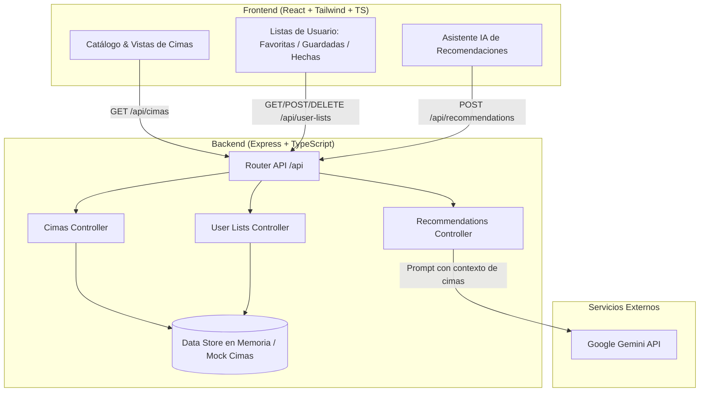

# Master Specification: Cimapp

**Versión**: 1.0.0  
**Estado**: Especificación Técnica Aprobada  
**Basado en**: [.specs/CONTEXTO_GLOBAL.md](file:///c:/Users/enelf/Desktop/cimapp/.specs/CONTEXTO_GLOBAL.md)

---

## 1. Visión General de la Arquitectura

`Cimapp` está concebida como una plataforma web monolítica modular estructurada como **Monorepo**. Proporciona una API RESTful en Express (TypeScript) para la gestión de cimas, estado de usuario y conexión segura con el SDK de Google Gemini, y una SPA en React con Tailwind CSS orientada a una experiencia visual interactiva y ágil.



---

## 2. Modelos de Datos del Dominio (Data Schemas)

Contratos tipados en TypeScript que rigen la comunicación entre backend y frontend.

### 2.1. Entidad Cima (`Cima`)
Representa cada pico de montaña en el catálogo.

```typescript
export type DificultadCima = 'Fácil' | 'Moderada' | 'Difícil' | 'Muy Difícil';

export interface Coordenadas {
  lat: number;
  lng: number;
}

export interface Cima {
  id: string;                      // Identificador único (slug o uuid, ej: 'mulhacen', 'aneto')
  nombre: string;                  // Nombre oficial de la cima
  altitud: number;                 // Altura en metros sobre el nivel del mar (m s. n. m.)
  dificultad: DificultadCima;       // Nivel técnico estandarizado
  provincia: string;               // Provincia o región (ej: 'Granada', 'Huesca', 'Tenerife')
  sistemaMontanoso: string;        // Cordillera o macizo (ej: 'Sierra Nevada', 'Pirineos', 'Picos de Europa')
  imagenes: string[];              // URLs de fotos de alta resolución de la cima y ruta
  descripcion: string;             // Resumen descriptivo, características y entorno
  desnivelPositivo?: number;       // Desnivel aproximado de la ascensión en metros (opcional)
  coordenadas?: Coordenadas;       // Coordenadas geográficas (latitud, longitud)
}
```

### 2.2. Entidad Listas de Usuario (`UserLists`)
Almacena el estado personal de cimas del montañero.

```typescript
export type TipoLista = 'favoritas' | 'guardadas' | 'hechas';

export interface UserLists {
  favoritas: string[]; // Array de IDs de Cima marcadas como preferidas
  guardadas: string[]; // Array de IDs de Cima guardadas / por hacer (wishlist)
  hechas: string[];    // Array de IDs de Cima completadas / coronadas
}

export interface ToggleListRequest {
  cimaId: string;
  listType: TipoLista;
}

export interface ToggleListResponse {
  cimaId: string;
  listType: TipoLista;
  active: boolean;
  lists: UserLists;
}
```

### 2.3. Entidades de Recomendación Inteligente (Gemini AI)

```typescript
export interface RecommendationRequest {
  nivel?: DificultadCima | string;  // Nivel de experiencia del usuario
  provincia?: string;              // Preferencia geográfica opcional
  altitudMaxima?: number;          // Techo de altitud deseado
  preferencias?: string;           // Texto libre (ej: "busco ruta familiar", "quiero trepada aérea")
}

export interface RecommendedCimaItem {
  cimaId: string;
  nombre: string;
  motivo: string;                  // Justificación personalizada de Gemini
  consejoSeguridad: string;        // Recomendación técnica o época idónea
}

export interface RecommendationResponse {
  mensaje: string;                 // Saludo o introducción contextual generada por Gemini
  recomendaciones: RecommendedCimaItem[];
  cimasDetalle?: Cima[];           // Entidades completas de las cimas sugeridas
}
```

### 2.4. Formato Estándar de Respuesta API (`ApiResponse<T>`)

```typescript
export interface ApiResponse<T> {
  success: boolean;
  data?: T;
  error?: string;
  message?: string;
}
```

---

## 3. Estructura de Rutas REST de Express (Backend API)

Todas las rutas públicas están prefijadas con `/api`.

| Método | Endpoint | Parámetros / Body | Descripción |
| :--- | :--- | :--- | :--- |
| `GET` | `/api/health` | N/A | Comprueba el estado del servidor y configuración de Gemini |
| `GET` | `/api/cimas` | Query: `search`, `dificultad`, `provincia`, `minAlt`, `maxAlt` | Obtiene el catálogo completo con soporte para filtrado |
| `GET` | `/api/cimas/:id` | Params: `id` | Obtiene los detalles completos de una cima concreta |
| `GET` | `/api/user-lists` | Query: `populate` (`boolean`) | Devuelve las listas del usuario (IDs o cimas pobladas) |
| `POST` | `/api/user-lists/toggle` | Body: `{ cimaId: string, listType: 'favoritas' \| 'guardadas' \| 'hechas' }` | Alterna una cima en una lista específica |
| `POST` | `/api/user-lists/:listType/:cimaId` | Params: `listType`, `cimaId` | Agrega explícitamente una cima a una lista |
| `DELETE` | `/api/user-lists/:listType/:cimaId` | Params: `listType`, `cimaId` | Elimina una cima de una lista |
| `POST` | `/api/recommendations` | Body: `RecommendationRequest` | Genera recomendaciones con la API de Gemini según nivel |

---

## 4. Estructura de Componentes React (Frontend)

El frontend se organiza siguiendo una arquitectura modular por características (`features`), componentes base (`ui`) y de estructura (`layout`):

```
apps/frontend/src/
├── components/
│   ├── layout/
│   │   ├── Navbar.tsx             # Barra superior con logo, enlaces de navegación y botón Gemini
│   │   ├── Hero.tsx               # Banner principal con buscador rápido y estadísticas
│   │   └── Footer.tsx             # Pie de página informativo
│   ├── cimas/
│   │   ├── CimaCard.tsx           # Tarjeta individual con imagen, altitud, provincia, badges y acciones
│   │   ├── CimaGrid.tsx           # Rejilla adaptativa para desplegar tarjetas de cimas
│   │   ├── CimaFilters.tsx        # Panel de filtros: dificultad, búsqueda, provincia y rango altitud
│   │   └── QuickActionButton.tsx  # Botón de acción rápida (favorita, guardada, hecha) con estado visual
│   ├── detail/
│   │   ├── CimaDetailModal.tsx    # Modal o vista de detalle completo de la cima
│   │   └── ImageGallery.tsx       # Galería de fotos con visor expandido y miniaturas
│   ├── lists/
│   │   ├── UserListsTabs.tsx      # Pestañas para cambiar entre Favoritas, Guardadas y Hechas
│   │   └── EmptyListState.tsx     # Estado vacío amigable cuando la lista seleccionada no tiene cimas
│   ├── ai/
│   │   ├── GeminiAdvisorModal.tsx # Diálogo interactivo para solicitar recomendaciones a la IA
│   │   └── RecommendationCard.tsx # Tarjeta especial para mostrar la cima sugerida con consejos de la IA
│   └── ui/
│       ├── Badge.tsx              # Badge de dificultad con código de colores montañero
│       ├── Button.tsx             # Botón estilizado con variantes
│       ├── Input.tsx              # Campo de búsqueda y texto
│       ├── Modal.tsx              # Diálogo accesible con backdrop difuminado
│       └── Spinner.tsx            # Indicador de carga
├── hooks/
│   ├── useCimas.ts                # Gestión del catálogo de cimas y filtrado en memoria
│   ├── useUserLists.ts            # Gestión de favoritas, guardadas y hechas con sincronización
│   └── useGeminiAdvisor.ts        # Llamada a la API de recomendaciones y manejo de estado de carga
├── services/
│   └── api.ts                     # Cliente Axios/Fetch centralizado con tipado de respuestas
└── types/
    └── index.ts                   # Re-exportación de interfaces de Cima, UserLists y Gemini
```

---

## 5. Diseño de Interfaz y Estados Visuales

### 5.1. Código de Color para Dificultad Técnica
- **Fácil**: Esmeralda/Verde (`bg-emerald-100 text-emerald-800 border-emerald-300`)
- **Moderada**: Azul Alpino (`bg-sky-100 text-sky-800 border-sky-300`)
- **Difícil**: Ámbar/Naranja (`bg-amber-100 text-amber-800 border-amber-300`)
- **Muy Difícil**: Rojo Granate (`bg-rose-100 text-rose-800 border-rose-300`)

### 5.2. Botones de Acción Rápida en Tarjetas
- **Favorita**: Icono de corazón (`Heart`), contorno neutro cuando inactivo, relleno rojo/carmesí al estar activo.
- **Guardada / Por Hacer**: Icono de marcador (`Bookmark`), contorno neutro cuando inactivo, relleno índigo/azul al estar activo.
- **Hecha / Coronada**: Icono de verificación/cima (`CheckCircle` o `Mountain`), contorno neutro cuando inactivo, relleno verde esmeralda al estar activo.

---

## 6. Integración con Gemini AI

- **Modelo**: `gemini-1.5-flash` (balance óptimo de latencia, coste y precisión de razonamiento).
- **Entorno**: Carga de variable `GEMINI_API_KEY` desde `.env`.
- **System Instruction**:
  > Eres "Cimapp AI", un guía de montaña profesional y experto en las cordilleras de España. Tu objetivo es asesorar a montañeros y excursionistas, recomendando cimas adecuadas según su nivel técnico y preferencias, haciendo hincapié en la seguridad, equipo requerido y respeto al medio natural.
- **Fallback**: En caso de no disponer de API Key o ante un fallo de red con Google, el backend realiza una selección ponderada sobre el catálogo interno para garantizar que la aplicación nunca se rompa.
